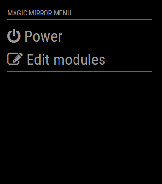
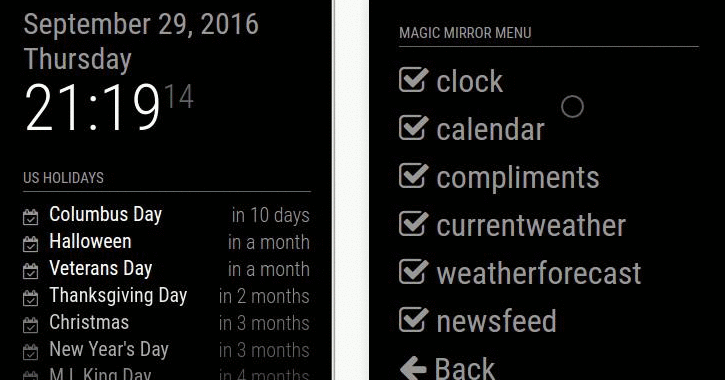

# Magic Mirror Module: Remote Control w/ RESTful API

This module for the [Magic Mirror²](https://github.com/MichMich/MagicMirror) allows you to quickly shutdown your mirror through a web browser.
The website should work fine on any device (desktop, smart phone, tablet, ...).
Since we all want our [SD cards to live a long and prosper life](http://raspberrypi.stackexchange.com/a/383) we properly shut down before pulling the power plug everytime, am I right?
Additionally you can hide and show modules on your mirror and do other cool stuff.





**New in Version 2.0.0:** The module now includes a more RESTful API for controlling all aspects of your mirror from other network-enabled devices and controllers--anything that can open a URL. See the [API README](API/README.md) for more info!

## Installation

### Quick install

If you followed the default installation instructions for the [Magic Mirror²](https://github.com/MichMich/MagicMirror) project, you should be able to use the automatic installer.
The following command will download the installer and execute it:
```bash
bash -c "$(curl -s https://raw.githubusercontent.com/Jopyth/MMM-Remote-Control/master/installer.sh)"
```

### Manual install

- (1) Clone this repository in your `modules` folder, and install dependencies:
```bash
cd ~/MagicMirror/modules # adapt directory if you are using a different one
git clone https://github.com/Jopyth/MMM-Remote-Control.git
cd MMM-Remote-Control
npm install
```

- (2) Add the module to your `config/config.js` file, if you add a `position`, it will display the URL to the remote on the mirror.
```js
{
    module: 'MMM-Remote-Control',
    // uncomment the following line to show the URL of the remote control on the mirror
    // position: 'bottom_left',
    // you can hide this module afterwards from the remote control itself
    config: {
        customCommand: {},  // Optional, See "Using Custom Commands" below
        showModuleApiMenu: true, // Optional, Enable the Module Controls menu
        secureEndpoints: true, // Optional, See API/README.md
        // uncomment any of the lines below if you're gonna use it
        // customMenu: "custom_menu.json", // Optional, See "Custom Menu Items" below
        // apiKey: "", // Optional, See API/README.md for details
        // classes: {} // Optional, See "Custom Classes" below
    }
},
```

- (3) For security reasons, the MagicMirror (and therefore the Remote Control) is *not* reachable externally.
To change this, configure `address`, and `ipWhitelist` in your `config.js` (see [these lines in the sample config](https://github.com/MichMich/MagicMirror/blob/master/config/config.js.sample#L12-L22)).
For example change `address` to `0.0.0.0` and add two allowed devices with IP-Adresses `192.168.0.42` and `192.168.0.50`:
```
    address : '0.0.0.0',
    port: 8080,
    ipWhitelist: ["127.0.0.1", "::ffff:127.0.0.1", "::1", "::ffff:192.168.0.42", "::ffff:192.168.0.50"],"
```
You can also add multiple devices in an IP range (e.g. all devices with `192.168.0.X`):
```
    ipWhitelist: ["127.0.0.1", "::ffff:127.0.0.1", "::1", "::ffff:192.168.0.1/120", "192.168.0.1/24"],
```

- (4) Restart your Magic Mirror² (i.e. `pm2 restart MagicMirror`).

- (5) Access the remote interface on [http://192.168.xxx.xxx:8080/remote.html](http://192.168.xxx.xxx:8080/remote.html) (replace with IP address of your RaspberryPi).

Note: If your user does not have `sudo` rights, the shutdown does not work (it *should* work for everyone who did not change anything on this matter).

### Update

Update this module by navigating into its folder on the command line and using `git pull`:

```bash
cd ~/MagicMirror/modules/MMM-Remote-Control # adapt directory if you are using a different one
git pull
npm install # install (new) dependencies
```

Alternatively you can run the `installer.sh` script again:
```bash
~/MagicMirror/modules/MMM-Remote-Control/installer.sh
```

### Select version manually

You can check out specific versions in the following way.
First look at which versions are available:
```bash
cd MagicMirror/modules/MMM-Remote-Control # or wherever you installed the Mirror and the module
git fetch # fetch all tags
git tag # display them
```

The output should look similar to this:
```
v1.0.0
v1.1.0
v1.1.1
v1.1.2
```
Then you can checkout that version with, for example `git checkout v1.0.0`, or use `git checkout master` to checkout the most recent version.

## Known limitations

Whenever you change the order of modules in `config.js` or add/remove modules, the indices of the modules change.
Therefore the hidden/shown status of modules might not be correctly applied.
If this happens, simply reconfigure and save it again.

## Call methods from other modules

You can call any of the methods provided in the UI directly through a GET request, or a module notification.
For example you can use [MMM-ModuleScheduler](https://forum.magicmirror.builders/topic/691/mmm-modulescheduler) to automatically shutdown your RasberryPi at a certain time, or integrate it with home automation systems. Or use  [MMM-Navigate](https://github.com/Ax-LED/MMM-Navigate) to allow direct actions from your Mirror by using a rotating button. 

### Examples

- Example for a REST API GET request to trigger a RaspberryPi restart:
```
http://192.168.xxx.xxx:8080/api/restart
```

- Example to trigger a RaspberryPi restart in your module:
```
this.sendNotification('REMOTE_ACTION', {action: 'RESTART'});
```

See some specific examples for controlling your mirror from other modules and add your own examples [in the Wiki page here](https://github.com/shbatm/MMM-Remote-Control/wiki/Examples-for-Controlling-from-Another-Module)

### List of actions

#### System Control:

| Action | Description |
| :-: | ------------- |
| SHUTDOWN | Shutdown your RaspberryPi |
| REBOOT | Restart your RaspberryPi |
| MONITORON | Switch your display on. Also sends a `"USER_PRESENCE": true` notification. |
| MONITOROFF | Switch your display off. Also sends a `"USER_PRESENCE": false` notification. |
| MONITORTOGGLE | Toggle the display on or off (with respective `"USER_PRESENCE"` notification. |
| MONITORSTATUS | Report back the monitor status (on or off) |

#### MagicMirror Control:

| Action | Description |
| :-: | ------------- |
| RESTART | Restart your MagicMirror |
| REFRESH | Refresh mirror page |
| UPDATE | Update MagicMirror and any of it's modules |
| SAVE | Save the current configuration (show and hide status of modules, and brightness), will be applied after the mirror starts |
| BRIGHTNESS | Change mirror brightness, with the new value specified by `value`. `100` equals the default, possible range is between `10` and `200`. |

#### MagicMirror Electron Browser Window Control:

| Action | Description |
| :-: | ------------- |
| MINIMIZE | Minimize the browser window. |
| TOGGLEFULLSCREEN | Toggle fullscreen mode on and off. |
| DEVTOOLS | Open the DevTools console window. |

#### Module Control:

| Action | Description |
| :-: | ------------- |
| HIDE | Hide a module, with the name (or identifier--see `MODULE_DATA` action) specified by `module` in the payload. You can also send `module: "all"` to hide all modules. |
| SHOW | Show a module (see above for how to specify which one). |
| TOGGLE | Toggle a module's visiblity (see above for how to specify which one). |
| FORCE | Force a module to show (see above for how to specify which one). |
| MODULE_DATA | Returns a JSON format of the data displayed in the UI, including all valid identifiers for the `HIDE` and `SHOW` action. |

#### Alerts and Notifications:

| Action | Description |
| :-: | ------------- |
| SHOW_ALERT | Show Default Alert/Notification |
| HIDE_ALERT | Hide Default Alert/Notification |
| USER_PRESENCE | Will send a notification "USER_PRESENCE" = true or false (according to "value" to all other modules. See examples above|
| NOTIFICATION | To send a notification to all modules, see the example in the [API README](API/README.md) |
| DELAYED | Send any of the above nested inside a "DELAYED" call to delay the action. Default is 10s. See Delayed Actions below. |

### Format of module data response

The response will be in the JSON format, here is an example:

```json
{
"moduleData":[
    {"hidden":false,"name":"alert","identifier":"module_0_alert"},
    {"hidden":true,"name":"clock","identifier":"module_1_clock","position":"bottom_right"},
    {"hidden":false,"name":"currentweather","identifier":"module_2_currentweather","position":"top_right"}
],
"brightness":40,
"settingsVersion":1
}
```

### Delayed Actions

You can delay an action by sending the notification nested inside of a `"DELAYED"` notification. Below is an example of turning off the monitor in 60s.

```js
this.sendSocketNotification("REMOTE_ACTION",
    {
        action: "DELAYED",
        did: "SOME_UNIQUE_ID", // Optional; Some string, in case you want to cancel later.
        timeout: 60,  // Optional; Default 10s
        abort: false, // Optional; send true to cancel an existing timer
        query: {
            action: "MONITOROFF"
        }
    });
```

Can also be used with the [API](https://documenter.getpostman.com/view/6167403/Rzfni66c) by adding `/delay?timeout=10s&did=something` to some routes.

### Using Custom Commands

Depending on your installation, some `shell` commands used by this module are not appropriate and can be overwritten by something that will work for you. To overwrite the commands, add a `customCommand` object to your config section.  The following commands are supported:

```js
    customCommand: {
        shutdownCommand: 'shell command to shutdown your pc',
        rebootCommand: 'shell command to reboot your pc',
        monitorOnCommand: 'shell command to turn on your monitor',
        monitorOffCommand: 'shell command to turn off your monitor',
        monitorStatusCommand: 'shell command to return status of monitor, must return either "HDMI" or "true" if screen is on; or "TV is Off" or "false" if it is off to be recognized'
    }
```

### Custom Classes

You probably wanna hide or show some modules at the same time, right? It's everything that we want this module for, of course.
Well, now you can add as many classes as you like, and define whether they show themself, hide or toggle between the two stages!

```js
    classes: {
        "Any Name You Want": {
            hide: ["calendar"],
            show: ["newsfeed"],
            toggle: ["clock"],
        },
        "Another Name You Want": {
            hide: ["newsfeed"],
            show: ["calendar"],
        },
    }
```

### Custom Menu Items

You can create your own customized menu items by providing creating a JSON file for the menu and providing a `customMenu: "custom_menu.json"` directive in your config. The file may be called whatever you want, but the name must be provided in the `config` section, and it must be stored in the Mirror's `config/` directory (same place as your `config.js` file).

An example menu is provided in this module's folder, titled `custom_menu.example.json`. You can copy this to the `/config` folder and modify as you need.

#### Key Components:

| Name | Description |
| :-: | - |
| `id` | The HTML id prefix to use for the menu item.
| `type` | The item type, either `'menu'` or `'item'`. `'menu'` is used to indicate the item is a sub-menu and has an ``items`` array. `'item'` is used for single menu items and will send a socket "REMOTE_ACTION" notification back to the server.  This requires `action:` and `content:` parameters before it can do anything.
| `text` | The text to display.  You can use the translate string `'%%TRANSLATE:YOUR_KEY_HERE%%'`, but remember to also update the appropriate file in `/translations`.
| `icon` | The [FontAwesome](https://fontawesome.com/v4.7.0/icons/) icon to use (without the leading `-fa`)
| `items` | An array of sub-menu items to use with `"type":"menu"`. Should be the same format as the top level menu (i.e. the menu structure is recursive).
| `action` | The `REMOTE_ACTION` notification action name, usually `NOTIFICATION`. Required for `"type":"item"` items to be able to do anything.
| `content` | The `REMOTE_ACTION` action payload to send.  Usually for `"NOTIFICATION"`, this is of the form `{ "notification": "NOTIFICATION_TO_SEND", "payload": "PAYLOAD_TO_SEND"}`

## License

### The MIT License (MIT)

Copyright © 2016 Joseph Bethge

Permission is hereby granted, free of charge, to any person
obtaining a copy of this software and associated documentation
files (the “Software”), to deal in the Software without
restriction, including without limitation the rights to use,
copy, modify, merge, publish, distribute, sublicense, and/or sell
copies of the Software, and to permit persons to whom the
Software is furnished to do so, subject to the following
conditions:

The above copyright notice and this permission notice shall be
included in all copies or substantial portions of the Software.

**The software is provided “as is”, without warranty of any kind, express or implied, including but not limited to the warranties of merchantability, fitness for a particular purpose and noninfringement. In no event shall the authors or copyright holders be liable for any claim, damages or other liability, whether in an action of contract, tort or otherwise, arising from, out of or in connection with the software or the use or other dealings in the software.**
