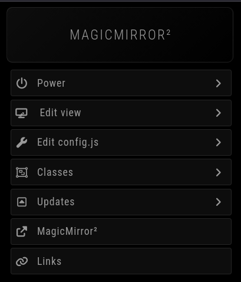
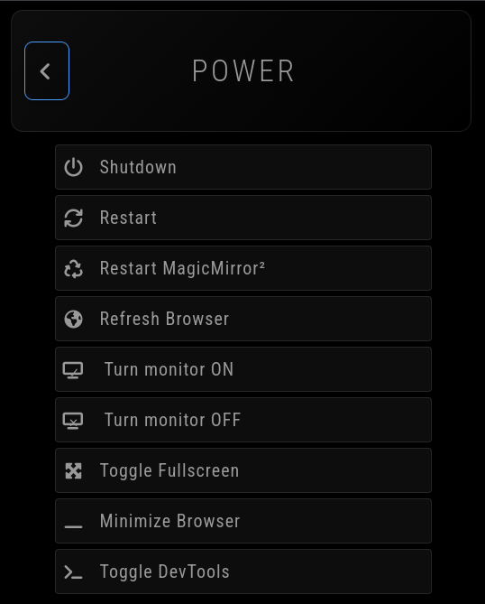
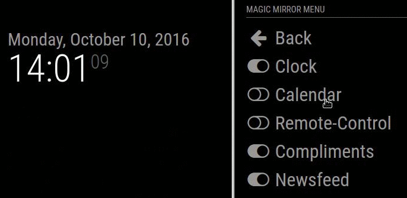

[](https://github.com/Jopyth/MMM-Remote-Control/actions/workflows/automated-tests.yaml) [](https://github.com/Jopyth/MMM-Remote-Control/tags) [](LICENSE.md)

# MMM-Remote-Control

**MMM-Remote-Control** is a module for [MagicMirror²](https://github.com/MagicMirrorOrg/MagicMirror) that allows you to use a browser, to quickly shut down your mirror, hide and show modules on your mirror and do other cool stuff.

The website should work fine on any device (desktop, smartphone, tablet, ...).

Since we all want our [SD cards to live a long and prosper life](http://raspberrypi.stackexchange.com/a/383) we shut down properly every time before unplugging, right?

The module also includes a **RESTful API** for controlling all aspects of your mirror from other network-enabled devices and controllers--anything that can open a URL. See the [API README](API/README.md) for more info!

## Screenshots

### Main menu



### Power menu



### Screencast "Hide and show a module"



## Installation

### Quick install

If you followed the default installation instructions for the [MagicMirror²](https://github.com/MagicMirrorOrg/MagicMirror) project, you should be able to use the automatic installer.

The following command will download the installer and execute it:

```bash
bash -c "$(curl -s https://raw.githubusercontent.com/Jopyth/MMM-Remote-Control/master/installer.sh)"
```

### Manual install

- (1) Clone this repository in your `modules` folder, and install dependencies:

```bash
cd ~/MagicMirror/modules
git clone https://github.com/Jopyth/MMM-Remote-Control
cd MMM-Remote-Control
npm ci --omit=dev
```

- (2) Add the module to your `config.js` file, if you add a `position`, it will display the URL to the remote on the mirror.

```js
    {
        module: 'MMM-Remote-Control',
        // uncomment the following line to show the URL of the remote control on the mirror
        // position: 'bottom_left',
        // you can hide this module afterwards from the remote control itself
        config: {
            customCommand: {},  // Optional, See "Using Custom Commands" below
            showModuleApiMenu: true, // Optional, Enable the Module Controls menu
            secureEndpoints: true, // Optional, See API/README.md
            // uncomment any of the lines below if you're gonna use it
            // customMenu: "custom_menu.json", // Optional, See "Custom Menu Items" below
            // apiKey: "", // Optional, See API/README.md for details
            // classes: {} // Optional, See "Custom Classes" below
        }
    },
```

- (3) For security reasons, the MagicMirror² (and therefore the Remote Control) is _not_ reachable externally.
  To change this, configure `address`, and `ipWhitelist` in your `config.js` (see [these lines in the sample config](https://github.com/MagicMirrorOrg/MagicMirror/blob/master/config/config.js.sample#L12-L22)).
  For example change `address` to `0.0.0.0` and add two allowed devices with IP addresses `192.168.0.42` and `192.168.0.50`:

```js
    address : '0.0.0.0',
    port: 8080,
    ipWhitelist: ["127.0.0.1", "::ffff:127.0.0.1", "::1", "::ffff:192.168.0.42", "::ffff:192.168.0.50"],"
```

You can also add multiple devices in an IP range (e.g. all devices with `192.168.0.X`):

```js
    ipWhitelist: ["127.0.0.1", "::ffff:127.0.0.1", "::1", "::ffff:192.168.0.1/120", "192.168.0.1/24"],
```

- (4) Restart your MagicMirror² (i.e. `pm2 restart MagicMirror`).

- (5) Access the remote interface on [http://192.168.xxx.xxx:8080/remote.html](http://192.168.xxx.xxx:8080/remote.html) (replace with IP address of your RaspberryPi).

Note: If your user does not have `sudo` rights, the shutdown does not work (it _should_ work for everyone who did not change anything on this matter).

### Update

Update this module by navigating into its folder on the command line and using `git pull`:

```bash
cd ~/MagicMirror/modules/MMM-Remote-Control
git pull
npm ci --omit=dev
```

Alternatively you can run the `installer.sh` script again:

```bash
~/MagicMirror/modules/MMM-Remote-Control/installer.sh
```

### Select version manually

You can check out specific versions in the following way.
First look at which versions are available:

```bash
cd MagicMirror/modules/MMM-Remote-Control # or wherever you installed the Mirror and the module
git fetch # fetch all tags
git tag # display them
```

The output should look similar to this:

```bash
v1.0.0
v1.1.0
v1.1.1
v1.1.2
```

Then you can checkout that version with, for example `git switch --detach v1.0.0`, or use `git switch master` to checkout the most recent version.

## Known limitations

Whenever you change the order of modules in `config.js` or add/remove modules, the indices of the modules change.
Therefore the hidden/shown status of modules might not be correctly applied.
If this happens, simply reconfigure and save it again.

## Call methods from other modules

You can call any of the methods provided in the UI directly through a GET request, or a module notification.
For example you can use [MMM-ModuleScheduler](https://forum.magicmirror.builders/topic/691/mmm-modulescheduler) to automatically shutdown your RaspberryPi at a certain time, or integrate it with home automation systems. Or use [MMM-Navigate](https://github.com/Ax-LED/MMM-Navigate) to allow direct actions from your Mirror by using a rotating button.

### Examples

- Example for a REST API GET request to trigger a RaspberryPi restart:

`http://192.168.xxx.xxx:8080/api/restart`

- Example to trigger a RaspberryPi restart in your module:

```js
this.sendNotification("REMOTE_ACTION", { action: "RESTART" });
```

See some specific examples for controlling your mirror from other modules and add your own examples [in the Wiki page here](https://github.com/Jopyth/MMM-Remote-Control/wiki/Examples-for-Controlling-from-Another-Module)

### List of actions

#### System Control

|    Action     | Description                                                                   |
| :-----------: | ----------------------------------------------------------------------------- |
|   SHUTDOWN    | Shutdown your RaspberryPi                                                     |
|    REBOOT     | Restart your RaspberryPi                                                      |
|   MONITORON   | Switch your display on. Also sends a `"USER_PRESENCE": true` notification.    |
|  MONITOROFF   | Switch your display off. Also sends a `"USER_PRESENCE": false` notification.  |
| MONITORTOGGLE | Toggle the display on or off (with respective `"USER_PRESENCE"` notification. |
| MONITORSTATUS | Report back the monitor status (on or off)                                    |

#### MagicMirror² Control

|   Action   | Description                                                                                                                            |
| :--------: | -------------------------------------------------------------------------------------------------------------------------------------- |
|  RESTART   | Restart your MagicMirror²                                                                                                              |
|  REFRESH   | Refresh mirror page                                                                                                                    |
|   UPDATE   | Update MagicMirror² and any of it's modules                                                                                            |
|    SAVE    | Save the current configuration (show and hide status of modules, and brightness), will be applied after the mirror starts              |
| BRIGHTNESS | Change mirror brightness, with the new value specified by `value`. `100` equals the default, possible range is between `10` and `200`. |

#### MagicMirror² Electron Browser Window Control

|      Action      | Description                        |
| :--------------: | ---------------------------------- |
|     MINIMIZE     | Minimize the browser window.       |
| TOGGLEFULLSCREEN | Toggle fullscreen mode on and off. |
|     DEVTOOLS     | Open the DevTools console window.  |

#### Module Control

|   Action    | Description                                                                                                                                                         |
| :---------: | ------------------------------------------------------------------------------------------------------------------------------------------------------------------- |
|    HIDE     | Hide a module, with the name (or identifier--see `MODULE_DATA` action) specified by `module` in the payload. You can also send `module: "all"` to hide all modules. |
|    SHOW     | Show a module (see above for how to specify which one).                                                                                                             |
|   TOGGLE    | Toggle a module's visibility (see above for how to specify which one).                                                                                              |
|    FORCE    | Force a module to show (see above for how to specify which one).                                                                                                    |
| MODULE_DATA | Returns a JSON format of the data displayed in the UI, including all valid identifiers for the `HIDE` and `SHOW` action.                                            |

#### Alerts and Notifications

|    Action     | Description                                                                                                             |
| :-----------: | ----------------------------------------------------------------------------------------------------------------------- |
|  SHOW_ALERT   | Show Default Alert/Notification                                                                                         |
|  HIDE_ALERT   | Hide Default Alert/Notification                                                                                         |
| USER_PRESENCE | Will send a notification "USER_PRESENCE" = true or false (according to "value" to all other modules. See examples above |
| NOTIFICATION  | To send a notification to all modules, see the example in the [API README](API/README.md)                               |
|    DELAYED    | Send any of the above nested inside a "DELAYED" call to delay the action. Default is 10s. See Delayed Actions below.    |

### Format of module data response

The response will be in the JSON format, here is an example:

```json
{
  "moduleData": [
    { "hidden": false, "name": "alert", "identifier": "module_0_alert" },
    {
      "hidden": true,
      "name": "clock",
      "identifier": "module_1_clock",
      "position": "bottom_right"
    },
    {
      "hidden": false,
      "name": "weather",
      "identifier": "module_2_weather",
      "position": "top_right"
    }
  ],
  "brightness": 40,
  "settingsVersion": 1
}
```

### Delayed Actions

You can delay an action by sending the notification nested inside of a `"DELAYED"` notification. Below is an example of turning off the monitor in 60s.

```js
this.sendSocketNotification("REMOTE_ACTION", {
  action: "DELAYED",
  did: "SOME_UNIQUE_ID", // Optional; Some string, in case you want to cancel later.
  timeout: 60, // Optional; Default 10s
  abort: false, // Optional; send true to cancel an existing timer
  query: {
    action: "MONITOROFF"
  }
});
```

Can also be used with the [API](https://documenter.getpostman.com/view/6167403/Rzfni66c) by adding `/delay?timeout=10s&did=something` to some routes.

### Using Custom Commands

Depending on your installation, some `shell` commands used by this module are not appropriate and can be overwritten by something that will work for you. To overwrite the commands, add a `customCommand` object to your config section. The following commands are supported:

```js
    customCommand: {
        shutdownCommand: 'shell command to shutdown your pc',
        rebootCommand: 'shell command to reboot your pc',
        monitorOnCommand: 'shell command to turn on your monitor',
        monitorOffCommand: 'shell command to turn off your monitor',
        monitorStatusCommand: 'shell command to return status of monitor, must return either "HDMI" or "true" if screen is on; or "TV is Off" or "false" if it is off to be recognized'
    }
```

#### Monitor Control Commands by Display System

**Since version 4.0.0**, the default monitor control commands have changed to support **Wayland** (the default display server in Raspberry Pi OS since Bookworm (released 2023)). If you're using a different setup or experiencing issues, configure the appropriate commands for your system:

##### Wayland (Default - Raspberry Pi OS Bookworm/Bullseye)

**Default commands** (no configuration needed):

```js
    customCommand: {
        monitorOnCommand: 'wlr-randr --output HDMI-A-1 --on',
        monitorOffCommand: 'wlr-randr --output HDMI-A-1 --off',
        monitorStatusCommand: 'wlr-randr | grep -q "Enabled: yes" && echo "true" || echo "false"'
    }
```

**Note:** You may need to install `wlr-randr` first:

```bash
sudo apt-get install wlr-randr
```

To find your correct output name (might be `HDMI-A-2`, `HDMI-1`, etc.), run:

```bash
wlr-randr
```

If `wlr-randr` doesn't work without specifying the display, try setting the `WAYLAND_DISPLAY` environment variable:

```js
    customCommand: {
        monitorOnCommand: 'WAYLAND_DISPLAY="wayland-1" wlr-randr --output HDMI-A-1 --on',
        monitorOffCommand: 'WAYLAND_DISPLAY="wayland-1" wlr-randr --output HDMI-A-1 --off',
        monitorStatusCommand: 'WAYLAND_DISPLAY="wayland-1" wlr-randr | grep -q "Enabled: yes" && echo "true" || echo "false"'
    }
```

##### X11 / Xorg

For systems using X11 (older Raspberry Pi OS or desktop Linux):

```js
    customCommand: {
        monitorOnCommand: 'xrandr --output HDMI-1 --auto',
        monitorOffCommand: 'xrandr --output HDMI-1 --off',
        monitorStatusCommand: 'xrandr | grep "HDMI-1 connected" | grep -q " [0-9]" && echo "true" || echo "false"'
    }
```

**Alternative with explicit display** (use if the above doesn't work):

```js
    customCommand: {
        monitorOnCommand: 'xrandr -d :0 --output HDMI-1 --auto',
        monitorOffCommand: 'xrandr -d :0 --output HDMI-1 --off',
        monitorStatusCommand: 'xrandr -d :0 --listmonitors | grep -v "Monitors: 0" && echo "true" || echo "false"'
    }
```

To find your output name, run:

```bash
xrandr | grep " connected"
```

Common output names: `HDMI-1`, `HDMI-2`, `DP-1`, `eDP-1`

##### Legacy vcgencmd (Raspberry Pi OS Buster and older)

If you're running an older Raspberry Pi OS version where `vcgencmd` still works:

```js
    customCommand: {
        monitorOnCommand: 'vcgencmd display_power 1',
        monitorOffCommand: 'vcgencmd display_power 0',
        monitorStatusCommand: 'vcgencmd display_power -1'
    }
```

**Note:** `vcgencmd display_power` has been deprecated and may not work on recent Raspberry Pi OS versions.

##### CEC (HDMI-CEC capable displays)

For displays that support HDMI-CEC control:

```js
    customCommand: {
        monitorOnCommand: 'echo "on 0" | cec-client -s -d 1',
        monitorOffCommand: 'echo "standby 0" | cec-client -s -d 1',
        monitorStatusCommand: 'echo "pow 0" | cec-client -s -d 1 | grep -q "power status: on" && echo "true" || echo "false"'
    }
```

Install `cec-client`:

```bash
sudo apt-get install cec-utils
```

##### DPMS (Generic Linux)

For generic Linux systems with DPMS support:

```js
    customCommand: {
        monitorOnCommand: 'xset dpms force on',
        monitorOffCommand: 'xset dpms force off',
        monitorStatusCommand: 'xset q | grep -q "Monitor is On" && echo "true" || echo "false"'
    }
```

##### GNOME/Mutter (Debian 13 Trixie and newer)

For systems using GNOME/Mutter display server (like Debian 13 Trixie):

```js
    customCommand: {
        monitorOnCommand: 'busctl --user set-property org.gnome.Mutter.DisplayConfig /org/gnome/Mutter/DisplayConfig org.gnome.Mutter.DisplayConfig PowerSaveMode i 0',
        monitorOffCommand: 'busctl --user set-property org.gnome.Mutter.DisplayConfig /org/gnome/Mutter/DisplayConfig org.gnome.Mutter.DisplayConfig PowerSaveMode i 1',
        monitorStatusCommand: 'busctl --user get-property org.gnome.Mutter.DisplayConfig /org/gnome/Mutter/DisplayConfig org.gnome.Mutter.DisplayConfig PowerSaveMode | grep -q "i 0" && echo "true" || echo "false"'
    }
```

##### Troubleshooting Monitor Control

If monitor control doesn't work:

1. **Verify your display server:**

   ```bash
   echo $XDG_SESSION_TYPE  # Should show 'wayland' or 'x11'
   ```

2. **Switch display server if needed:** On Raspberry Pi OS, you can switch between Wayland and X11:

   ```bash
   sudo raspi-config
   # Navigate to: Advanced Options -> Wayland -> Select X11 or Wayland -> Reboot
   ```

3. **Test commands manually:** Run the command directly in the terminal to ensure it works before adding it to the config.

4. **Check output names:** Display output names vary by system. Use `wlr-randr` (Wayland) or `xrandr` (X11) to find the correct name.

   For **Wayland**:

   ```bash
   wlr-randr
   ```

   For **X11**:

   ```bash
   xrandr -d :0  # or just: xrandr
   ```

5. **Multi-monitor setups:** If you have multiple HDMI outputs (like Raspberry Pi 4/5), make sure to specify the correct output (e.g., `HDMI-A-1` vs `HDMI-A-2`).

6. **Permissions:** Some commands may require additional permissions or group membership (e.g., `video` group for CEC).

7. **See the discussion:** For more solutions and community help, check [Issue #288](https://github.com/Jopyth/MMM-Remote-Control/issues/288).

### Custom Classes

You probably wanna hide or show some modules at the same time, right? It's everything that we want this module for, of course.
Well, now you can add as many classes as you like, and define whether they show themselves, hide or toggle between the two stages!

```js
    classes: {
        "Any Name You Want": {
            hide: ["calendar"],
            show: ["newsfeed"],
            toggle: ["clock"],
        },
        "Another Name You Want": {
            hide: ["newsfeed"],
            show: ["calendar"],
        },
    }
```

### Custom Menu Items

You can create your own customized menu items by providing creating a JSON file for the menu and providing a `customMenu: "custom_menu.json"` directive in your config. The file may be called whatever you want, but the name must be provided in the `config` section, and it must be stored in the Mirror's `config/` directory (same place as your `config.js` file).

An example menu is provided in this module's folder, titled `custom_menu.example.json`. You can copy this to the `/config` folder and modify as you need.

#### Key Components

|   Name   | Description                                                                                                                                                                                                                                                                                                           |
| :------: | --------------------------------------------------------------------------------------------------------------------------------------------------------------------------------------------------------------------------------------------------------------------------------------------------------------------- |
|   `id`   | The HTML id prefix to use for the menu item.                                                                                                                                                                                                                                                                          |
|  `type`  | The item type, either `'menu'` or `'item'`. `'menu'` is used to indicate the item is a sub-menu and has an `items` array. `'item'` is used for single menu items and will send a socket "REMOTE_ACTION" notification back to the server. This requires `action:` and `content:` parameters before it can do anything. |
|  `text`  | The text to display. You can use the translate string `'%%TRANSLATE:YOUR_KEY_HERE%%'`, but remember to also update the appropriate file in `/translations`.                                                                                                                                                           |
|  `icon`  | The [FontAwesome](https://fontawesome.com/v4.7.0/icons/) icon to use (without the leading `-fa`).                                                                                                                                                                                                                     |
| `items`  | An array of sub-menu items to use with `"type":"menu"`. Should be the same format as the top level menu (i.e. the menu structure is recursive).                                                                                                                                                                       |
| `action` | The `REMOTE_ACTION` notification action name, usually `NOTIFICATION`. Required for `"type":"item"` items to be able to do anything.                                                                                                                                                                                   |

## Contributing

For contributing to this repository, please see the [CONTRIBUTING.md](CONTRIBUTING.md) file.

### Tests & Quality

See [tests/README.md](./tests/README.md) for test setup, commands, and the roadmap. Quick commands:

- Lint & formatting: `node --run lint`
- Spell checking: `node --run test:spelling`
- Unit tests (Node built-in): `node --run test:unit`
- Coverage (c8): `node --run test:coverage`

## License

This project is licensed under the MIT License - see the [LICENSE](LICENSE.md) file for details.

## Changelog

All notable changes to this project will be documented in the [CHANGELOG.md](CHANGELOG.md) file.
