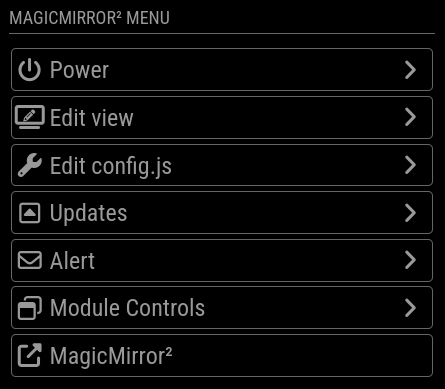
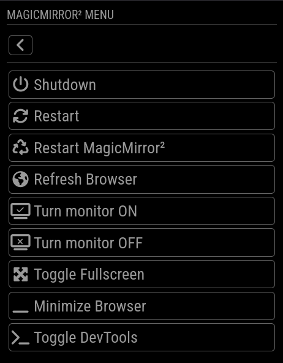
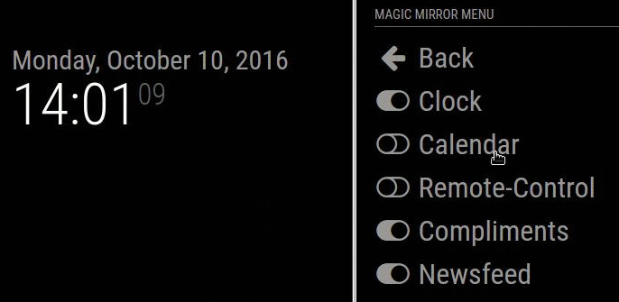

[](https://github.com/Jopyth/MMM-Remote-Control/actions/workflows/automated-tests.yaml) [](https://github.com/Jopyth/MMM-Remote-Control/tags) [](LICENSE.md)

# MMM-Remote-Control

**MMM-Remote-Control** is a module for [MagicMirror²](https://github.com/MagicMirrorOrg/MagicMirror) that allows you to use a browser, to quickly shut down your mirror, hide and show modules on your mirror and do other cool stuff.

The website should work fine on any device (desktop, smartphone, tablet, ...).

Since we all want our [SD cards to live a long and prosper life](http://raspberrypi.stackexchange.com/a/383) we shut down properly every time before unplugging, right?

The module also includes a **RESTful API** for controlling all aspects of your mirror from other network-enabled devices and controllers--anything that can open a URL. See the [API README](API/README.md) for more info!

## Screenshots

### Main menu



### Power menu



### Edit View menu


### Screencast "Hide and show a module"



## Installation

### Quick install

If you followed the default installation instructions for the [MagicMirror²](https://github.com/MagicMirrorOrg/MagicMirror) project, you should be able to use the automatic installer.

The following command will download the installer and execute it:

```bash
bash -c "$(curl -s https://raw.githubusercontent.com/Jopyth/MMM-Remote-Control/master/installer.sh)"
```

### Manual install

- (1) Clone this repository in your `modules` folder, and install dependencies:

```bash
cd ~/MagicMirror/modules
git clone https://github.com/Jopyth/MMM-Remote-Control
cd MMM-Remote-Control
npm ci --omit=dev
```

- (2) Add the module to your `config.js` file, if you add a `position`, it will display the URL to the remote on the mirror.

```js
    {
        module: 'MMM-Remote-Control',
        // uncomment the following line to show the URL of the remote control on the mirror
        // position: 'bottom_left',
        // you can hide this module afterwards from the remote control itself
        config: {
            customCommand: {},  // Optional, See "Using Custom Commands" below
            showModuleApiMenu: true, // Optional, Enable the Module Controls menu
            secureEndpoints: true, // Optional, See API/README.md
            // uncomment any of the lines below if you're gonna use it
            // customMenu: "custom_menu.json", // Optional, See "Custom Menu Items" below
            // apiKey: "", // Optional, See API/README.md for details
            // classes: {} // Optional, See "Custom Classes" below
        }
    },
```

- (3) For security reasons, the MagicMirror² (and therefore the Remote Control) is _not_ reachable externally.
  To change this, configure `address`, and `ipWhitelist` in your `config.js` (see [these lines in the sample config](https://github.com/MagicMirrorOrg/MagicMirror/blob/master/config/config.js.sample#L12-L22)).
  For example change `address` to `0.0.0.0` and add two allowed devices with IP addresses `192.168.0.42` and `192.168.0.50`:

```js
    address : '0.0.0.0',
    port: 8080,
    ipWhitelist: ["127.0.0.1", "::ffff:127.0.0.1", "::1", "::ffff:192.168.0.42", "::ffff:192.168.0.50"],"
```

You can also add multiple devices in an IP range (e.g. all devices with `192.168.0.X`):

```js
    ipWhitelist: ["127.0.0.1", "::ffff:127.0.0.1", "::1", "::ffff:192.168.0.1/120", "192.168.0.1/24"],
```

- (4) Restart your MagicMirror² (i.e. `pm2 restart MagicMirror`).

- (5) Access the remote interface on [http://192.168.xxx.xxx:8080/remote.html](http://192.168.xxx.xxx:8080/remote.html) (replace with IP address of your RaspberryPi).

Note: If your user does not have `sudo` rights, the shutdown does not work (it _should_ work for everyone who did not change anything on this matter).

### Update

Update this module by navigating into its folder on the command line and using `git pull`:

```bash
cd ~/MagicMirror/modules/MMM-Remote-Control
git pull
npm ci --omit=dev
```

Alternatively you can run the `installer.sh` script again:

```bash
~/MagicMirror/modules/MMM-Remote-Control/installer.sh
```

### Select version manually

You can check out specific versions in the following way.
First look at which versions are available:

```bash
cd MagicMirror/modules/MMM-Remote-Control # or wherever you installed the Mirror and the module
git fetch # fetch all tags
git tag # display them
```

The output should look similar to this:

```bash
v1.0.0
v1.1.0
v1.1.1
v1.1.2
```

Then you can checkout that version with, for example `git switch --detach v1.0.0`, or use `git switch master` to checkout the most recent version.

## Known limitations

Whenever you change the order of modules in `config.js` or add/remove modules, the indices of the modules change.
Therefore the hidden/shown status of modules might not be correctly applied.
If this happens, simply reconfigure and save it again.

## Call methods from other modules

You can call any of the methods provided in the UI directly through a GET request, or a module notification.
For example you can use [MMM-ModuleScheduler](https://forum.magicmirror.builders/topic/691/mmm-modulescheduler) to automatically shutdown your RaspberryPi at a certain time, or integrate it with home automation systems. Or use [MMM-Navigate](https://github.com/Ax-LED/MMM-Navigate) to allow direct actions from your Mirror by using a rotating button.

### Examples

- Example for a REST API GET request to trigger a RaspberryPi restart:

`http://192.168.xxx.xxx:8080/api/restart`

- Example to trigger a RaspberryPi restart in your module:

```js
this.sendNotification("REMOTE_ACTION", { action: "RESTART" });
```

See the [Examples Guide](docs/guide/examples.md) for more integration examples with MMM-ModuleScheduler, MMM-Navigate, Home Assistant, and more.

### List of actions

#### System Control

|    Action     | Description                                                                   |
| :-----------: | ----------------------------------------------------------------------------- |
|   SHUTDOWN    | Shutdown your RaspberryPi                                                     |
|    REBOOT     | Restart your RaspberryPi                                                      |
|   MONITORON   | Switch your display on. Also sends a `"USER_PRESENCE": true` notification.    |
|  MONITOROFF   | Switch your display off. Also sends a `"USER_PRESENCE": false` notification.  |
| MONITORTOGGLE | Toggle the display on or off (with respective `"USER_PRESENCE"` notification. |
| MONITORSTATUS | Report back the monitor status (on or off)                                    |

#### MagicMirror² Control

|   Action   | Description                                                                                                                            |
| :--------: | -------------------------------------------------------------------------------------------------------------------------------------- |
|  RESTART   | Restart your MagicMirror²                                                                                                              |
|  REFRESH   | Refresh mirror page                                                                                                                    |
|   UPDATE   | Update MagicMirror² and any of it's modules                                                                                            |
|    SAVE    | Save the current configuration (show and hide status of modules, and brightness), will be applied after the mirror starts              |
| BRIGHTNESS | Change mirror brightness, with the new value specified by `value`. `100` equals the default, possible range is between `10` and `200`. |

#### MagicMirror² Electron Browser Window Control

|      Action      | Description                        |
| :--------------: | ---------------------------------- |
|     MINIMIZE     | Minimize the browser window.       |
| TOGGLEFULLSCREEN | Toggle fullscreen mode on and off. |
|     DEVTOOLS     | Open the DevTools console window.  |

#### Module Control

|   Action    | Description                                                                                                                                                         |
| :---------: | ------------------------------------------------------------------------------------------------------------------------------------------------------------------- |
|    HIDE     | Hide a module, with the name (or identifier--see `MODULE_DATA` action) specified by `module` in the payload. You can also send `module: "all"` to hide all modules. |
|    SHOW     | Show a module (see above for how to specify which one).                                                                                                             |
|   TOGGLE    | Toggle a module's visibility (see above for how to specify which one).                                                                                              |
|    FORCE    | Force a module to show (see above for how to specify which one).                                                                                                    |
| MODULE_DATA | Returns a JSON format of the data displayed in the UI, including all valid identifiers for the `HIDE` and `SHOW` action.                                            |

#### Alerts and Notifications

|    Action     | Description                                                                                                             |
| :-----------: | ----------------------------------------------------------------------------------------------------------------------- |
|  SHOW_ALERT   | Show Default Alert/Notification                                                                                         |
|  HIDE_ALERT   | Hide Default Alert/Notification                                                                                         |
| USER_PRESENCE | Will send a notification "USER_PRESENCE" = true or false (according to "value" to all other modules. See examples above |
| NOTIFICATION  | To send a notification to all modules, see the example in the [API README](API/README.md)                               |
|    DELAYED    | Send any of the above nested inside a "DELAYED" call to delay the action. Default is 10s. See Delayed Actions below.    |

### Format of module data response

The response will be in the JSON format, here is an example:

```json
{
  "moduleData": [
    { "hidden": false, "name": "alert", "identifier": "module_0_alert" },
    {
      "hidden": true,
      "name": "clock",
      "identifier": "module_1_clock",
      "position": "bottom_right"
    },
    {
      "hidden": false,
      "name": "weather",
      "identifier": "module_2_weather",
      "position": "top_right"
    }
  ],
  "brightness": 40,
  "settingsVersion": 1
}
```

### Delayed Actions

You can delay an action by sending the notification nested inside of a `"DELAYED"` notification. Below is an example of turning off the monitor in 60s.

```js
this.sendSocketNotification("REMOTE_ACTION", {
  action: "DELAYED",
  did: "SOME_UNIQUE_ID", // Optional; Some string, in case you want to cancel later.
  timeout: 60, // Optional; Default 10s
  abort: false, // Optional; send true to cancel an existing timer
  query: {
    action: "MONITOROFF"
  }
});
```

Can also be used with the [API](https://documenter.getpostman.com/view/6167403/Rzfni66c) by adding `/delay?timeout=10s&did=something` to some routes.

### Using Custom Commands

Override default shell commands for shutdown, reboot, and monitor control. See the [Custom Commands Guide](docs/guide/custom-commands.md) for details.

> **Monitor not turning on/off?** The default `vcgencmd` commands don't work on newer Raspberry Pi OS (Bookworm+). See the [Monitor Control Guide](docs/guide/monitor-control.md) for Wayland, X11, CEC, and other options.

### Custom Classes

Group modules to show/hide together with a single action. See the [Classes Guide](docs/guide/classes.md) for details.

```js
    classes: {
        "Day Mode": {
            show: ["clock", "weather"],
            hide: ["screensaver"],
        },
    }
```

### Custom Menu Items

Create custom buttons in the web interface. See the [Custom Menus Guide](docs/guide/custom-menus.md) for details.

Copy `custom_menu.example.json` to your MagicMirror `config/` folder, rename it, and add to your config:

```js
    customMenu: "custom_menu.json",
```

## Documentation

For detailed documentation, see the [docs/guide/](docs/guide/) folder:

- [Configuration](docs/guide/configuration.md) - All config options
- [Monitor Control](docs/guide/monitor-control.md) - Wayland, X11, CEC commands
- [Custom Commands](docs/guide/custom-commands.md) - Shell command overrides
- [Custom Menus](docs/guide/custom-menus.md) - Build custom UI buttons
- [Classes](docs/guide/classes.md) - Group modules together
- [Examples](docs/guide/examples.md) - Integration with other modules
- [FAQ](docs/guide/faq.md) - Troubleshooting

## Contributing

For contributing to this repository, please see the [CONTRIBUTING.md](CONTRIBUTING.md) file.

### Tests & Quality

See [tests/README.md](./tests/README.md) for test setup, commands, and the roadmap. Quick commands:

- Lint & formatting: `node --run lint`
- Spell checking: `node --run test:spelling`
- Unit tests (Node built-in): `node --run test:unit`
- Coverage (c8): `node --run test:coverage`

## License

This project is licensed under the MIT License - see the [LICENSE](LICENSE.md) file for details.

## Changelog

All notable changes to this project will be documented in the [CHANGELOG.md](CHANGELOG.md) file.
